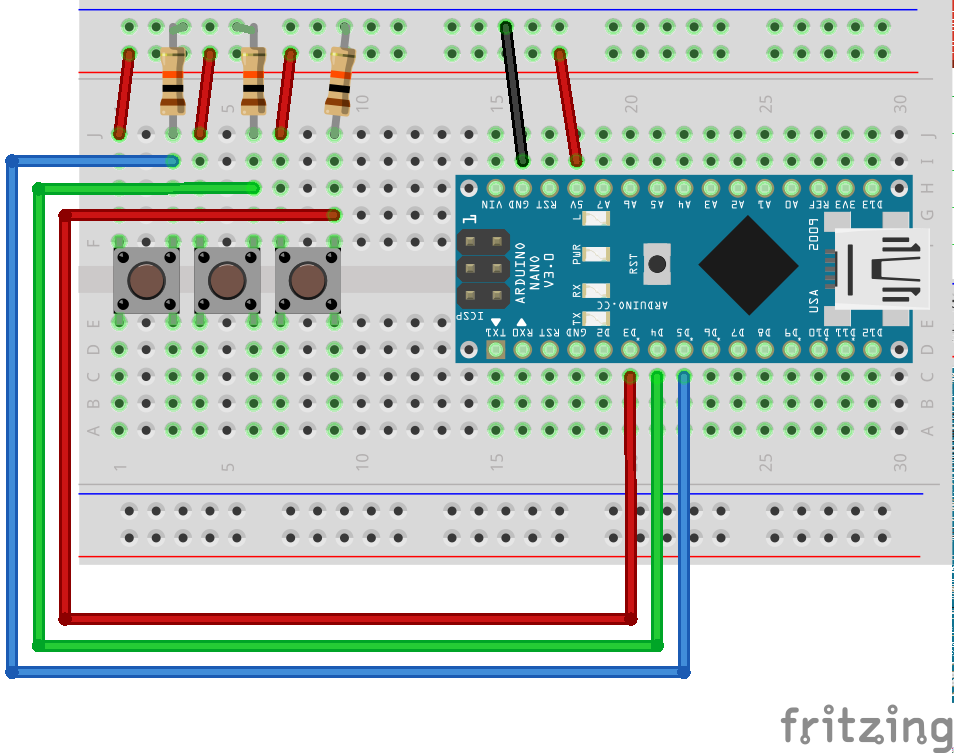

## RGB Switch


```javascript
import five from 'johnny-five';

let board = new five.Board();

board.on('ready', () => {
    let red = new five.Button({
            pin: 3
        }),
        green = new five.Button({
            pin: 4
        }),
        blue = new five.Button({
            pin: 5
        }),
        rgb = {
            r: 0,
            g: 0,
            b: 0
        };

    function onRelease() {
        console.log(`r: ${rgb.r}, g: ${rgb.g}, b: ${rgb.b}`);
    }

    red.on('hold', function onHold() {
        if (rgb.r > 0) {
            rgb.r -= 5;
        }
    });

    red.on('press', function onPress() {
        if (rgb.r < 255) {
            rgb.r += 5;
        }
    });
    red.on('release', onRelease);


    green.on('hold', function onHold() {
        if (rgb.g > 0) {
            rgb.g -= 5;
        }
    });

    green.on('press', function onPress() {
        if (rgb.g < 255) {
            rgb.g += 5;
        }
    });
    green.on('release', onRelease);


    blue.on('hold', function onHold() {
        if (rgb.b > 0) {
            rgb.b -= 5;
        }
    });

    blue.on('press', function onPress() {
        if (rgb.b < 255) {
            rgb.b += 5;
        }
    });
    blue.on('release', onRelease);

});

```

